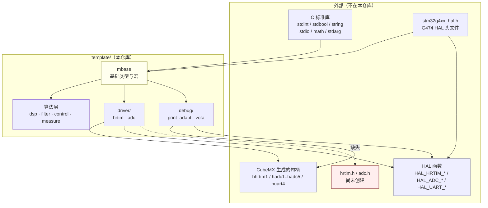
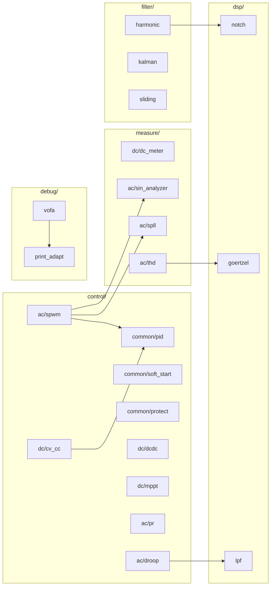
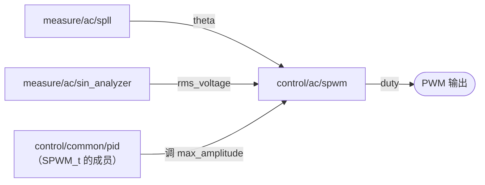

# DianSai2026 · 电赛电源方向软件模板

把单相逆变器涉及的算法拆成独立可复用的 C 模块，供备赛时按需取用。
`template/` 是**模块化的算法模板，不是可直接烧录的固件**——没有构建系统、没有 `main.c`，
HAL 与 CubeMX 生成的代码都在外部工程里。

各模块的 API 见 [`template/doc.md`](template/doc.md)，
开发约定见 [`CLAUDE.md`](CLAUDE.md)。

---

## 一、依赖总览（分层 + 外部）

箭头方向为「**依赖**」：`A --> B` 表示 A 依赖 B。



**读图要点**

| 关系 | 含义 |
|---|---|
| `HALH --> MB` | `mbase.h` 里 `#include "stm32g4xx_hal.h"`，所以**全树都间接依赖 G474 的 HAL** |
| `MB --> ALG` | 算法层全部 `#include "mbase.h"`，因此原本芯片无关的算法层现在也绑定了 G474 |
| `DRV --> HDL` | driver 不定义句柄，只通过宏引用 CubeMX 生成的 `hhrtim1` / `hadc1` 等 |
| `DRV -.-> MISS` | `config_hrtim.h` / `config_adc.h` include 的 `hrtim.h` / `adc.h` **尚未创建**，这是当前唯一的编译阻断 |

---

## 二、template 内部依赖

只画**跨模块**的 `#include`，不含 `mbase`——**所有模块都直接包含 `mbase.h`**，
画出来会盖住其余关系，故省略。



### 跨模块依赖速查

| 模块 | 依赖 | 用途 |
|---|---|---|
| `filter/harmonic` | `dsp/notch` | 三个陷波器级联做 2/3/5 次抑制 |
| `measure/ac/thd` | `dsp/goertzel` | 每个谐波次一个 Goertzel 单元 |
| `control/ac/droop` | `dsp/lpf` | P/Q 进下垂计算前必须低通 |
| `control/dc/cv_cc` | `control/common/pid` | 电压环、电流环各一个 PI |
| `control/ac/spwm` | `control/common/pid`、`measure/ac/sin_analyzer`、`measure/ac/spll` | 闭环调压 + 锁相 |
| `debug/vofa` | `debug/print_adapt` | VOFA 协议走 `Printf_Normal` |

### 其余模块

`dsp/lpf`、`filter/kalman`、`filter/sliding`、`control/common/{soft_start,protect}`、
`control/dc/{dcdc,mppt}`、`control/ac/pr`、`measure/dc/dc_meter`、`measure/ac/sin_analyzer`、
`measure/ac/spll`、`debug/print_adapt` —— **只依赖 `mbase`**，彼此独立。

---

## 三、当前实际被连起来的调用链

上面的图是 **include 关系**。真正在**调用**上串起来的只有这一条：



`filter/`（harmonic / kalman / sliding）与 `dsp/`、`control` 的大部分模块
目前**没有任何调用点**，属于待取用状态。

---

## 目录说明

```
template/     算法模块（本仓库主体）
  mbase/        基础类型与宏，所有模块的根依赖
  driver/       MCU 外设驱动（hrtim / adc）
  dsp/          通用 DSP 原语（notch / goertzel / lpf）
  filter/       通用滤波器（harmonic / kalman / sliding）
  control/      控制（common / dc / ac）
  measure/      测量与估计（dc / ac）
  debug/        调试输出与上位机
docs/         原理笔记（SPWM、单相逆变、赛题资料）
knowledge/    学习清单
tmp/          临时文件（已 gitignore）
```
