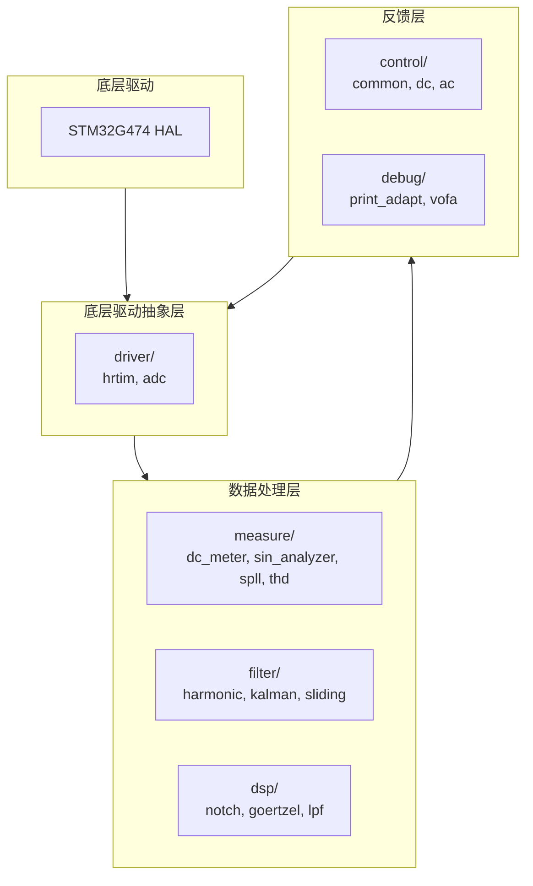

# DianSai2026 · 电赛电源方向软件模板

把电源类赛题涉及的算法拆成独立可复用的 C 模块，供备赛时按需取用。
`template/` 是**模块化的算法模板，不是可直接烧录的固件**——没有构建系统、没有 `main.c`，
HAL 与 CubeMX 生成的代码都在外部工程里。

各模块 API 见 [`template/doc.md`](template/doc.md)，开发约定见 [`CLAUDE.md`](CLAUDE.md)。

---

## 一、这个模板在抽象什么

**任何一道电源题，本质都是一个闭环：**

> 功率级 → 传感器 → **测量** → **控制** → **驱动** → 功率级

模板把这条链路上的每一环各拆成一层，共四层，自下而上摞起来：
**L0 底层驱动 → L1 驱动抽象 → L2 数据处理 → L3 反馈**，
L3 算出的结果再交回 L1 去执行，闭合成环。



**向上是数据流，向下是决策流。** `L0 → L1 → L2 → L3` 是采样一路上行变成决策，
`L3 → L1` 是决策交回驱动去执行，两者合起来构成一个控制环。

分层依据是**离具体题目有多远**，不是抽象程度的高低（见第二节末尾）。

`mbase`（类型与宏）被所有模块直接包含，是唯一的公共底座。画进去会让每一层都多
一条汇入线，图面上反而盖住结构，故略去。

---

## 二、每层对应哪些电源知识点

| 层                | 模块              | 抽象自哪些知识点                                                        |
| ----------------- | ----------------- | ----------------------------------------------------------------------- |
| **L3 反馈层**     | `control/common/` | 调节器（PI）、软启动、阈值保护                                          |
|                   | `control/dc/`     | 三种 DC-DC 拓扑的前馈、恒压/恒流双环、MPPT                              |
|                   | `control/ac/`     | 准比例谐振、下垂均流、SPWM 调制                                         |
|                   | `debug/`          | 波形上送与观测                                                          |
| **L2 数据处理层** | `measure/`        | 有效值、均值、纹波峰峰值、有功/无功/视在功率、功率因数、频率、相位、THD |
|                   | `filter/`         | 卡尔曼、滑动平均、谐波抑制 —— 信号净化                                  |
|                   | `dsp/`            | 单频点 DFT、陷波器、一阶低通 —— 与电路无关的信号处理原语                |
| **L1 驱动抽象层** | `driver/`         | PWM 生成、高分辨率定时、互补输出与死区、与开关周期同步的采样            |
| **L0 底层驱动**   | —                 | STM32G474 HAL、CubeMX 生成的句柄                                        |

**同一根轴上**（L1~L3），越往上越贴近题目：L3 的 `mppt` 只服务光伏题、
`droop` 只服务并联题，换道题就作废；L2 的 `dsp/notch` 与具体电路毫无关系，
任何需要陷波的场合都能拿走。

**L0 与 L1 是另一根轴**：它们不随题目变，但**随芯片变**——换 MCU 要重写这两层，
而 L2、L3 一行不用动。这正是把驱动单独抽出来做一层的理由。

---

## 三、层与层之间传什么

| 从         | 到         | 层间  | 传什么                                                 |
| ---------- | ---------- | ----- | ------------------------------------------------------ |
| 功率级     | `measure/` | —     | 传感器采到的电压、电流                                 |
| `measure/` | `control/` | L2→L3 | `rms_voltage`、`active_power`、`theta`（相位）、`freq` |
| `control/` | `driver/`  | L3→L1 | 占空比、开关频率                                       |
| `driver/`  | 功率级     | —     | PWM 波形                                               |

（`功率级` 是外部硬件，不在分层图里，故层间一列留空。）

目前真正接通的是逆变这条链路：
`measure/ac/spll` 出 `theta` + `measure/ac/sin_analyzer` 出 `rms_voltage`
→ `control/ac/spwm` 算出占空比 → 交给 `driver/` 输出。
其余模块（`filter/`、`dsp/`、大部分 `control/`）**尚无调用点**，属于待取用。

---

## 四、模块清单

```
template/
  mbase/        基础类型与宏，所有模块的根依赖
  driver/       MCU 外设驱动 —— hrtim · adc
  dsp/          通用 DSP 原语 —— notch · goertzel · lpf
  filter/       通用滤波器 —— harmonic · kalman · sliding
  control/
    common/     与拓扑无关 —— pid · soft_start · protect
    dc/         直流量场合 —— dcdc · cv_cc · mppt
    ac/         交流量场合 —— pr · droop · spwm
  measure/
    dc/         直流量测量 —— dc_meter
    ac/         交流量测量 —— sin_analyzer · spll · thd
  debug/        调试输出与上位机 —— print_adapt · vofa
docs/           原理笔记（SPWM、单相逆变、赛题资料）
knowledge/      学习清单
tmp/            临时文件（已 gitignore）
```

跨模块依赖全树只有 8 条：`notch→harmonic`、`goertzel→thd`、`lpf→droop`、
`pid→cv_cc`、`pid→spwm`、`sin_analyzer→spwm`、`spll→spwm`、`print_adapt→vofa`。

---

> `driver/` 目前**不能编译**：`config_hrtim.h` / `config_adc.h` include 的
> `hrtim.h` / `adc.h` 尚未创建。
