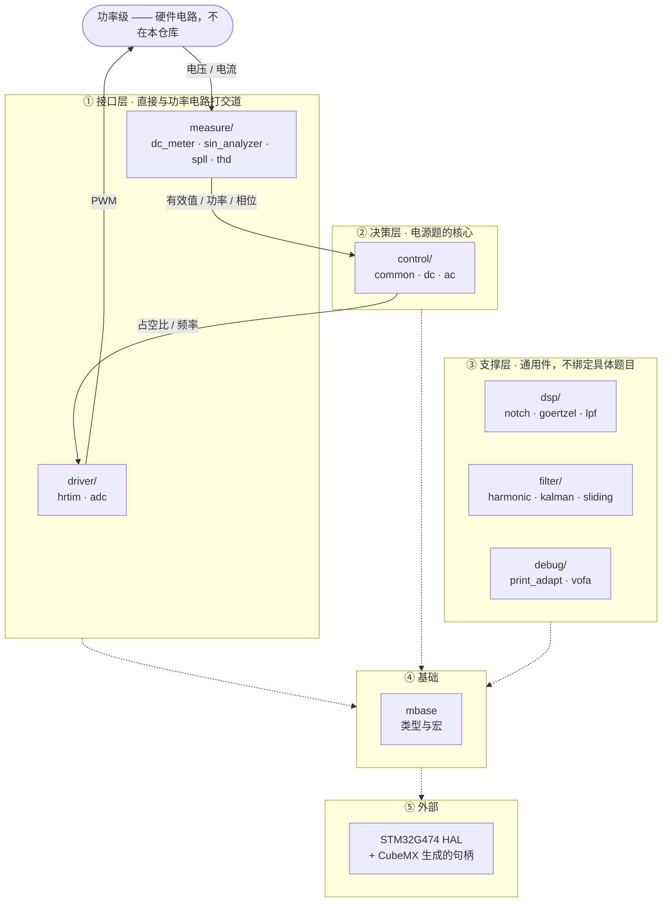

# DianSai2026 · 电赛电源方向软件模板

把电源类赛题涉及的算法拆成独立可复用的 C 模块，供备赛时按需取用。
`template/` 是**模块化的算法模板，不是可直接烧录的固件**——没有构建系统、没有 `main.c`，
HAL 与 CubeMX 生成的代码都在外部工程里。

各模块 API 见 [`template/doc.md`](template/doc.md)，开发约定见 [`CLAUDE.md`](CLAUDE.md)。

---

## 一、这个模板在抽象什么

**任何一道电源题，本质都是一个闭环：**

> 功率级 → 传感器 → **测量** → **控制** → **驱动** → 功率级

模板把这条链路上的每一环各拆成一层，再在下面垫两层通用件。
五个层次从下往上摞，越往上越贴近具体电路，越往下越通用、越能跨题复用。



**实线是控制环路**（数据怎么流），**虚线是依赖**（上层要用下层）。
虚线这样画是因为**每个模块都直接包含 `mbase.h`**，逐个画会把图变成毛线球。

---

## 二、每层对应哪些电源知识点

| 层 | 模块 | 抽象自哪些知识点 |
|---|---|---|
| **① 接口层** | `measure/` | 有效值、均值、纹波峰峰值、有功/无功/视在功率、功率因数、频率、相位、THD |
| | `driver/` | PWM 生成、高分辨率定时、互补输出与死区、与开关周期同步的采样 |
| **② 决策层** | `control/common/` | 调节器（PI）、软启动、阈值保护 |
| | `control/dc/` | 三种 DC-DC 拓扑的前馈、恒压/恒流双环、MPPT |
| | `control/ac/` | 准比例谐振、下垂均流、SPWM 调制 |
| **③ 支撑层** | `dsp/` | 单频点 DFT、陷波器、一阶低通 —— 与电路无关的信号处理原语 |
| | `filter/` | 卡尔曼、滑动平均、谐波抑制 —— 信号净化 |
| | `debug/` | 波形上送与观测 |
| **④ 基础** | `mbase` | 类型与宏，所有模块的根依赖 |
| **⑤ 外部** | — | STM32G474 HAL、CubeMX 生成的句柄 |

**越往上越专用**：`control/dc/` 里的 `mppt` 只服务光伏题，
`control/ac/` 里的 `droop` 只服务并联题。
**越往下越通用**：`dsp/notch` 与具体电路毫无关系，任何需要陷波的场合都能拿。

---

## 三、层与层之间传什么

| 从 | 到 | 传什么 |
|---|---|---|
| `measure/` | `control/` | `rms_voltage`、`active_power`、`theta`（相位）、`freq` |
| `control/` | `driver/` | 占空比、开关频率 |
| `driver/` | 功率级 | PWM 波形 |
| 功率级 | `measure/` | 传感器采到的电压、电流 |

目前真正接通的是逆变这条链路：
`measure/ac/spll` 出 `theta` + `measure/ac/sin_analyzer` 出 `rms_voltage`
→ `control/ac/spwm` 算出占空比 → 交给 `driver/` 输出。
其余模块（`filter/`、`dsp/`、大部分 `control/`）**尚无调用点**，属于待取用。

---

## 四、模块清单

```
template/
  mbase/        基础类型与宏，所有模块的根依赖
  driver/       MCU 外设驱动 —— hrtim · adc
  dsp/          通用 DSP 原语 —— notch · goertzel · lpf
  filter/       通用滤波器 —— harmonic · kalman · sliding
  control/
    common/     与拓扑无关 —— pid · soft_start · protect
    dc/         直流量场合 —— dcdc · cv_cc · mppt
    ac/         交流量场合 —— pr · droop · spwm
  measure/
    dc/         直流量测量 —— dc_meter
    ac/         交流量测量 —— sin_analyzer · spll · thd
  debug/        调试输出与上位机 —— print_adapt · vofa
docs/           原理笔记（SPWM、单相逆变、赛题资料）
knowledge/      学习清单
tmp/            临时文件（已 gitignore）
```

跨模块依赖全树只有 8 条：`notch→harmonic`、`goertzel→thd`、`lpf→droop`、
`pid→cv_cc`、`pid→spwm`、`sin_analyzer→spwm`、`spll→spwm`、`print_adapt→vofa`。

---

> `driver/` 目前**不能编译**：`config_hrtim.h` / `config_adc.h` include 的
> `hrtim.h` / `adc.h` 尚未创建。
