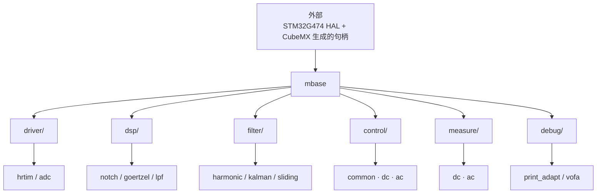
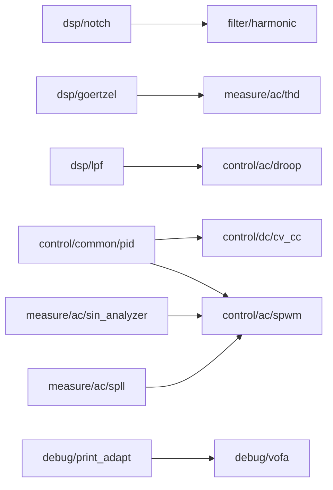
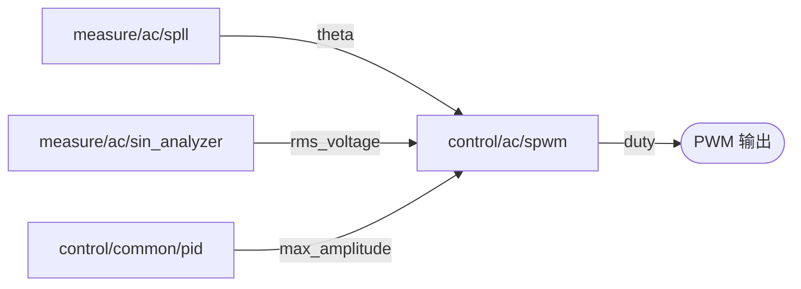

# DianSai2026 · 电赛电源方向软件模板

把单相逆变器涉及的算法拆成独立可复用的 C 模块，供备赛时按需取用。
`template/` 是**模块化的算法模板，不是可直接烧录的固件**——没有构建系统、没有 `main.c`，
HAL 与 CubeMX 生成的代码都在外部工程里。

各模块 API 见 [`template/doc.md`](template/doc.md)，开发约定见 [`CLAUDE.md`](CLAUDE.md)。

---

## 依赖关系

箭头方向为「**依赖**」：`A --> B` 表示 A 依赖 B。



**依赖只向下走一层。** 每个模块都直接 `#include "mbase.h"`，所以 `mbase` 是唯一的
汇聚点；除此之外全树只有下面这 8 条跨模块依赖。

---

## 跨模块依赖（全树仅此 8 条）



| 被依赖方 | 依赖方 | 用途 |
|---|---|---|
| `dsp/notch` | `filter/harmonic` | 三个陷波器级联做 2/3/5 次抑制 |
| `dsp/goertzel` | `measure/ac/thd` | 每个谐波次一个 Goertzel 单元 |
| `dsp/lpf` | `control/ac/droop` | P/Q 进下垂计算前必须低通 |
| `control/common/pid` | `control/dc/cv_cc` | 电压环、电流环各一个 |
| `control/common/pid` | `control/ac/spwm` | 调 `max_amplitude` |
| `measure/ac/sin_analyzer` | `control/ac/spwm` | 提供 `rms_voltage` |
| `measure/ac/spll` | `control/ac/spwm` | 提供 `theta` |
| `debug/print_adapt` | `debug/vofa` | VOFA 协议走 `Printf_Normal` |

其余模块（`dsp/lpf`、`filter/kalman`、`filter/sliding`、
`control/common/{soft_start,protect}`、`control/dc/{dcdc,mppt}`、`control/ac/pr`、
`measure/dc/dc_meter`、`debug/print_adapt` 等）**只依赖 `mbase`**，彼此独立。

---

## 实际调用链

上面是 **include 关系**。真正在**调用**上串起来的只有这一条：



`filter/`（harmonic / kalman / sliding）与 `dsp/`、大部分 `control` 模块
目前**没有任何调用点**，属于待取用状态。

---

## 目录说明

```
template/     算法模块（本仓库主体）
  mbase/        基础类型与宏，所有模块的根依赖
  driver/       MCU 外设驱动（hrtim / adc）
  dsp/          通用 DSP 原语（notch / goertzel / lpf）
  filter/       通用滤波器（harmonic / kalman / sliding）
  control/      控制（common / dc / ac）
  measure/      测量与估计（dc / ac）
  debug/        调试输出与上位机
docs/         原理笔记（SPWM、单相逆变、赛题资料）
knowledge/    学习清单
tmp/          临时文件（已 gitignore）
```

> `driver/` 目前**不能编译**：`config_hrtim.h` / `config_adc.h` include 的
> `hrtim.h` / `adc.h` 尚未创建。
