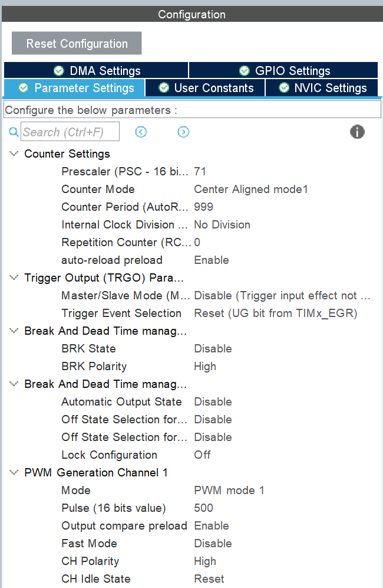
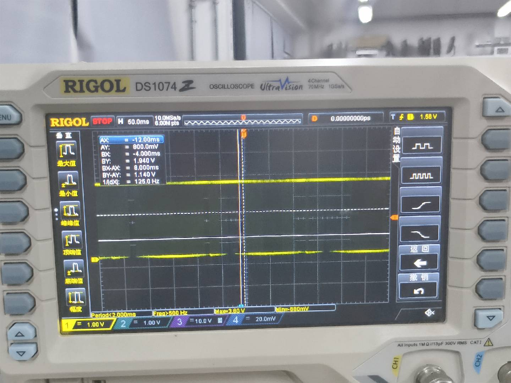
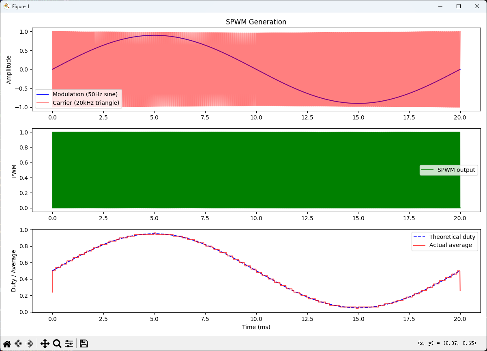
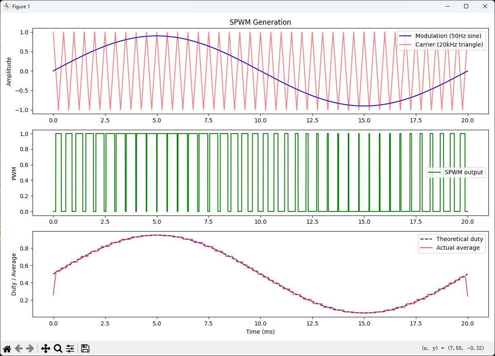

# 参考教程

[视频](https://www.bilibili.com/video/BV1GxpHzsENw)

[专栏](https://www.bilibili.com/read/cv22883556)

# 概念

将直流电转为交流电

若PWM频率及占空比恒定，则输出为方波，元件寿命会缩短

若想输出为正弦交流电，需要用高频PWM信号和电容电感->形成的交流电叫SPWM

# SPWM

## 最基础的版本——占空比呈正弦变化的方波

TIM1 Channel1配置



这里需要打表，否则调用`sin()`的话会卡住

但是貌似ai生成错了，不管了（吐舌）

```c
#define POINT_NUM 200  // 正弦波表的点数，点数越多波形越平滑，但太低会影响频率
const uint16_t sinTable[POINT_NUM] = {
    500, 515, 531, 547, 562, 578, 593, 609, 624, 639,  // 0-9
    654, 669, 684, 699, 713, 728, 742, 756, 770, 784,  // 10-19
    797, 811, 824, 837, 850, 862, 874, 886, 897, 908,  // 20-29
    919, 929, 939, 948, 957, 965, 973, 981, 988, 994,  // 30-39
    1000, 1000, 1000, 999, 998, 996, 994, 991, 988, 984, // 40-49
    980, 975, 970, 964, 958, 951, 944, 936, 928, 920,  // 50-59
    911, 902, 892, 882, 872, 861, 850, 839, 827, 815,  // 60-69
    803, 791, 778, 766, 753, 740, 727, 714, 700, 687,  // 70-79
    673, 660, 646, 632, 619, 605, 591, 577, 564, 550,  // 80-89
    536, 523, 509, 496, 483, 470, 457, 444, 432, 420,  // 90-99
    408, 396, 385, 374, 363, 352, 342, 332, 323, 314,  // 100-109
    305, 297, 289, 281, 274, 267, 261, 255, 250, 245,  // 110-119
    241, 237, 233, 230, 228, 226, 224, 223, 223, 223,  // 120-129
    223, 224, 226, 228, 230, 233, 237, 241, 245, 250,  // 130-139
    255, 261, 267, 274, 281, 289, 297, 305, 314, 323,  // 140-149
    332, 342, 352, 363, 374, 385, 396, 408, 420, 432,  // 150-159
    444, 457, 470, 483, 496, 509, 523, 536, 550, 564,  // 160-169
    577, 591, 605, 619, 632, 646, 660, 673, 687, 700,  // 170-179
    714, 727, 740, 753, 766, 778, 791, 803, 815, 827,  // 180-189
    839, 850, 861, 872, 882, 892, 902, 911, 920, 928   // 190-199
};

void HAL_TIM_PeriodElapsedCallback(TIM_HandleTypeDef *htim)
{
  // 判断是不是我们配置的TIM1触发的中断
  if (htim->Instance == TIM1)
  {
	static uint16_t i = 0;
    // 从正弦波表中取出第i个值，设置给TIM1通道1的比较寄存器
    __HAL_TIM_SET_COMPARE(&htim1, TIM_CHANNEL_1, sinTable[i]);

    // 索引自增，指向正弦波表中的下一个点
    i++;
    // 如果到了表末尾，则回到表头，形成一个循环
    if (i >= POINT_NUM) i = 0;
  }
}
```

使能PWM和重装载更新中断

```c
HAL_TIM_PWM_Start(&htim1, TIM_CHANNEL_1);
// 使能TIM1的更新中断，计数器每完成一个上坡+下坡，就会触发一次中断
__HAL_TIM_ENABLE_IT(&htim1, TIM_IT_UPDATE);
```

效果图



## SPWM本质

$占空比\times 正弦信号$

## SPWM驱动方式

单极性SPWM、双极性SPWM

### 单极性SPWM

H2与L2互补，H1与L1互补

H2：产生正弦信号，占空比随正弦的绝对值大小变化

H1：控制导通和换向


#### 优点:

- 高效,一个高频率MOS管负责产生正弦,一个低频率MOS管负责导通电流,低频率MOS管开关损耗小
- 谐波更低,波形更好(THD较低)

#### 缺点:

- 控制方式复杂,高低频驱动电路不同


### 双极性SPWM

sin值为0处占空比为1/2，为-1时为0，为1时为1


#### 优点

控制简单,驱动通用

#### 缺点

导通损耗高,谐波杂

### 对比


## 演示代码

```python
import numpy as np
import matplotlib.pyplot as plt

# 参数
fm = 50  # 调制波频率 50Hz
fc = 20000  # 载波频率 20kHz
M = 0.9  # 调制度
fs = 1000000  # 仿真采样率 1MHz
t = np.linspace(0, 0.02, int(fs * 0.02))  # 一个周期 20ms

# 调制波
m = M * np.sin(2 * np.pi * fm * t)

# 载波（三角波）
carrier = 2 * np.abs(2 * (t * fc % 1) - 1) - 1  # 归一化到[-1,1]

# SPWM：m > carrier 则输出1，否则0
pwm = (m > carrier).astype(float)

# 理论占空比
duty_theory = 0.5 + 0.5 * m

plt.figure(figsize=(12, 8))
plt.subplot(3, 1, 1)
plt.plot(t * 1000, m, "b", label="Modulation (50Hz sine)")
plt.plot(t * 1000, carrier, "r", alpha=0.5, label="Carrier (20kHz triangle)")
plt.legend()
plt.ylabel("Amplitude")
plt.title("SPWM Generation")

plt.subplot(3, 1, 2)
plt.plot(t * 1000, pwm, "g", label="SPWM output")
plt.legend()
plt.ylabel("PWM")

plt.subplot(3, 1, 3)
plt.plot(t * 1000, duty_theory, "b--", label="Theoretical duty")
# 用滑动平均提取实际占空比
window = int(fs / fc)
pwm_avg = np.convolve(pwm, np.ones(window) / window, mode="same")
plt.plot(t * 1000, pwm_avg, "r", alpha=0.7, label="Actual average")
plt.legend()
plt.ylabel("Duty / Average")
plt.xlabel("Time (ms)")

plt.tight_layout()
plt.savefig("spwm_math_verification.png", dpi=150)
plt.show()

```

当`fc=20000`时：



当`fc=2000`时：



# 计算

## 总体电压计算

占空比注入正弦信号：
$$
\sin(t) \cdot D
$$
D为调制系数，0~1

瞬时电压：
$$
V_{in}\cdot \sin(t) \cdot D
$$

幅值区间正弦函数信号$\sin(t)=1$

幅值电压：
$$
V_{in}\cdot D
$$

## 单路电压计算

### 单极性SPWM

通路1：
$$
V_{out}=V_{in} \cdot \sin(t) \cdot D,0<t<\frac{1}{2}T
$$

通路2：
$$
V_{out}=V_{in} \cdot \sin(t) \cdot D,\frac{1}{2}T<t<T
$$

### 双极性SPWM

通路1/半桥1：
$$
V_{out}=\frac{1}{2}V_{in} \cdot \sin(t) \cdot D+\frac{1}{2}V_{in}
$$

通路2/半桥2：
$$
V_{out}=-\frac{1}{2}V_{in} \cdot \sin(t) \cdot D+\frac{1}{2}V_{in}
$$

总体电压：
$$
总体电压=半桥1-半桥2=V_{in} \cdot \sin(t) \cdot D
$$